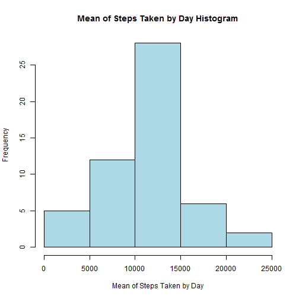
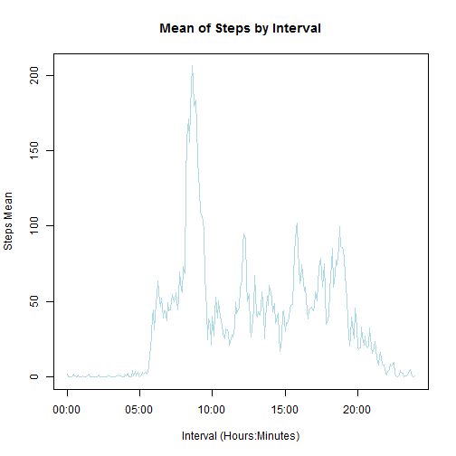
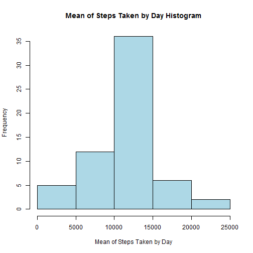
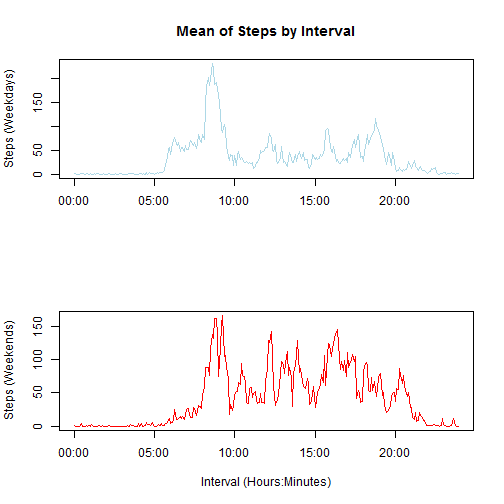
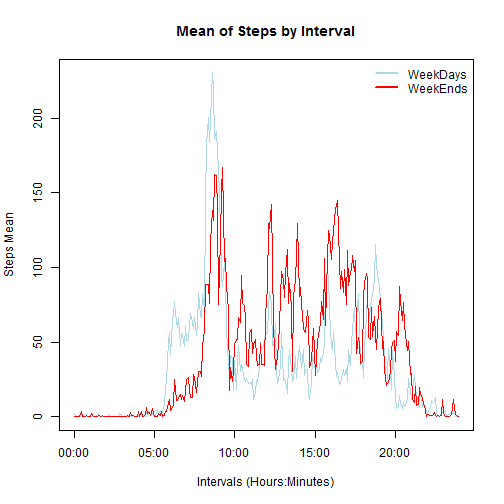

This assignment uses collected data from a Activity Tracker device in order to practice KNITR utilisation for Repoducible data and documentation. Collected data counts individual steps taken and recorded at 5 minute intervals all day long during two months.

This document will follow same sequence as Assignment document (READ file from repo).

Mentioned analysis will try to answer these questions:  

**1. What is mean total number of steps taken per day?**  
**2. What is the average daily activity pattern?**  
**3. Are there differences in activity patterns between weekdays and weekends?**  

For the first two question, all analysis made are excluding any AN treatment/correction. For third question, AN data is corrected by adding in NA places the mean/average of steps per interval over all days.

### Setting analysis environment  

In order to process and interrogate the data, preferred method is dplyr package: it much like SQL query language and from author's point of view it is an understandable way to show how data is processed and results calculated.  


```r
setwd("~/R/RepRes-Assig01")
library(dplyr)
```


### Loading and cleaning provided data  

Please, notice **interval** and **date** field conversions to work date and time units in an apropriate manner.  


```r
RawActivity <- read.csv("activity.csv")
RawActivityTb <- tbl_df(RawActivity)

rm(RawActivity)

ActivityTbClean <-  RawActivityTb %>% 
                    transmute   (steps, 
                    interval =  as.POSIXct(paste(interval %/% 100,interval %% 100, sep=":"),
                                format = "%H:%M"), 
                    date =      as.POSIXct(date,format = "%Y-%m-%d"))
```


###What is mean total number of steps taken per day?  

1. NA data from **steps** field is excluded, and **steps** field is accumulated by **date**.  


```r
ActStepsByDayClean <- 	ActivityTbClean %>%
						filter 		(!is.na(steps)) %>%
						group_by	(date) %>%
						summarise	(StepsByDay = sum(steps))
```


2. Resulting data is plotted in an Histagram Chart:  


```r
with(ActStepsByDayClean,(hist(StepsByDay,
                              xlab = "Mean of Steps Taken by Day",
                              main = "Mean of Steps Taken by Day Histogram",
                              col = "light blue")))
```

 


3. Mean and Median of the total number of steps taken per day:  


```r
MeanStepsbyDayClean 	<- 	as.numeric(summarise(ActStepsByDayClean,mean(StepsByDay)))
MedianStepsbyDayClean	<- 	as.numeric(summarise(ActStepsByDayClean,median(StepsByDay)))
```


Results:  

Mean of total of steps per day:   **10766.189**  
Median of total of steps per day: **10765.000**  

As a reminder, these results are calculated *without NA values* for **steps** field.

###What is the average daily activity pattern?  

Preparing data for new plot: NA data from **steps** field is excluded, and **steps** field is averaged by **interval**.


```r
MeanStepsByIntervalClean <- ActivityTbClean %>%
                            filter    (!is.na(steps)) %>%
                            group_by  (interval) %>%
                            summarise (MeanStepsByInt = mean(steps))
```


1. Time series plot with average number of steps taken by interval over all days:  


```r
with (MeanStepsByIntervalClean,	
     {plot  (interval, MeanStepsByInt, type = "n",
             main = "Mean of Steps by Interval",
             xlab = "Interval (Hours:Minutes)",
             ylab = "Steps Mean")
      lines (interval, MeanStepsByInt, col = "light blue")
     })
```

 


2. To calculate which 5 minute interval and obtain the maximum average number of steps:  


```r
MaxMeanStepsByIntClean  <- as.numeric(summarise(MeanStepsByIntervalClean,max(MeanStepsByInt)))   						 
MaxStepsIntervalClean   <- substr(as.character(
                           filter(MeanStepsByIntervalClean,
                                  MeanStepsByInt == MaxMeanStepsByIntClean)$interval)
                           ,12,16)
```

Results:  

Maximum Mean of total of steps per Interval: **206.1698**  
Interval where this Maximum ocurs: **08:35**  

###Imputing missing values  

1. To calculate the total number of missing values in the dataset:  


```r
NumberNA <- as.numeric(RawActivityTb %>% 
                       filter(is.na(steps)) %>% 
                       count())
```


Then, total number of rows with NA in **steps** field is: 2304  

2. To fill all these missing values, it has been already calculated the mean value per interval for all days (in *What is the average daily activity pattern?* data preparation), so these results are used to substitute missing values.

3. To create a new dataset with missing data filled/substituted with mean of interval for all days, basically original dataset is joined with mentioned results from Average Activity Pattern, a temporary field is created with data from **steps** (if it is not NA) or from **MeanStepsByIntervalClean$MeanStepsByInt** if original steps value is NA. A little additional "massaging" over resulting data structure to obtain same data table structure as the original one:


```r
# Joining All Data with Mean interval result by Interval value

ActivityTb_01 <- full_join(ActivityTbClean,
                           MeanStepsByIntervalClean,
                           by = "interval")

# Assigning to newsteps field either original values or Mean steps 
# depending on if steps is NA or not

ActivityTb_02 <- rbind	(ActivityTb_01 %>%
                        filter(is.na(steps)) %>%
                        mutate(newsteps = MeanStepsByInt),
                        ActivityTb_01 %>%
                        filter(!is.na(steps)) %>%
                        mutate(newsteps = steps))

# Just to keep all data ordered as original
# and renaming fields as original data

ActivityTb <- ActivityTb_02 %>% 
              arrange(date,interval) %>% 
              transmute(date, interval, steps = newsteps)

# Removing Temporal Tables

rm(ActivityTb_01)
rm(ActivityTb_02)
```

4. With resulting dataset, a new histogram is created. Previously, data is prepared:


```r
ActStepsByDay <- ActivityTb %>%
                 filter    (!is.na(steps)) %>%
                 group_by  (date) %>%
                 summarise (StepsByDay = sum(steps))
```

Resulting Histogram:


```r
with(ActStepsByDay,(hist(StepsByDay,
                         xlab = "Mean of Steps Taken by Day",
                         main = "Mean of Steps Taken by Day Histogram",
                         col = "light blue")))
```

 

The new values for mean and median are:


```r
MeanStepsbyDay   <- as.numeric(summarise(ActStepsByDay,mean(StepsByDay)))
MedianStepsbyDay <- as.numeric(summarise(ActStepsByDay,median(StepsByDay)))
```

New results are:  

Mean of total of steps per day:   **10766.189**  
Median of total of steps per day: **10766.189**  


###Are there differences in activity patterns between weekdays and weekends?

1. To create a new factor field **ActivityWeek** with two levels: weekday and weekend, and then look for differences in activity during weekdays and weekends.


```r
# A rowbinding for two sub-tables:
# One with data for weekends and other with data for weekdays
# creating a new factor field to discriminate both data groups

ActivityTbWeek <-	rbind(ActivityTb %>%
                        filter (weekdays(date) == "Saturday" | weekdays(date) == "Sunday") %>%
                        mutate (ActivityWeek = as.factor("weekend")),
                        ActivityTb %>%
                        filter (!(weekdays(date) == "Saturday" | weekdays(date) == "Sunday")) %>%
                        mutate (ActivityWeek = as.factor("weekday"))) 
```

2. A panel showing a double time series plot for intervals, and mean of steps taken per interval over all weekends and weekdays. First, preparing the data:


```r
MeanStepsByIntervalWeek	<- ActivityTbWeek %>%
                           group_by  (ActivityWeek, interval) %>%
                           summarise (MeanStepsByIntWeek = mean(steps))
```

The resulting Plot is:


```r
par(mfrow = c(2, 1))

#Plot Weekdays

with (MeanStepsByIntervalWeek %>%
      filter(ActivityWeek =="weekday"),
  {
  plot  (interval, MeanStepsByIntWeek, type = "n",
         main = "Mean of Steps by Interval",
         xlab = "",
         ylab = "Steps (Weekdays)")
  lines (interval, MeanStepsByIntWeek, col = "light blue")})

#Plot Weekend

with (MeanStepsByIntervalWeek %>%
      filter(ActivityWeek =="weekend"),
	{
  plot  (interval, MeanStepsByIntWeek, type = "n",
         main = "",
         xlab = "Interval (Hours:Minutes)",
         ylab = "Steps (Weekends)")
  lines (interval, MeanStepsByIntWeek, col = "red")})
```

 

Or another way to show differences:


```r
#Plot Weekdays

with (MeanStepsByIntervalWeek %>%
      filter(ActivityWeek =="weekday"),
  {
  plot  (interval, MeanStepsByIntWeek, type = "n",
         main = "Mean of Steps by Interval",
         xlab = "Intervals (Hours:Minutes)",
         ylab = "Steps Mean")
  lines (interval, MeanStepsByIntWeek, col = "light blue")})

#Plot Weekend

with (MeanStepsByIntervalWeek %>%
      filter(ActivityWeek =="weekend"),
  {
  lines (interval, MeanStepsByIntWeek, col = "red")})

  legend("topright", legend = c("WeekDays","WeekEnds"),
			   lwd = 2, bty = "n" , col = c("light blue","red"))
```

 
